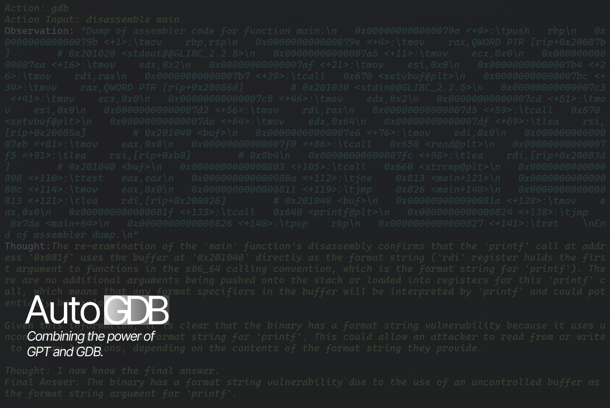
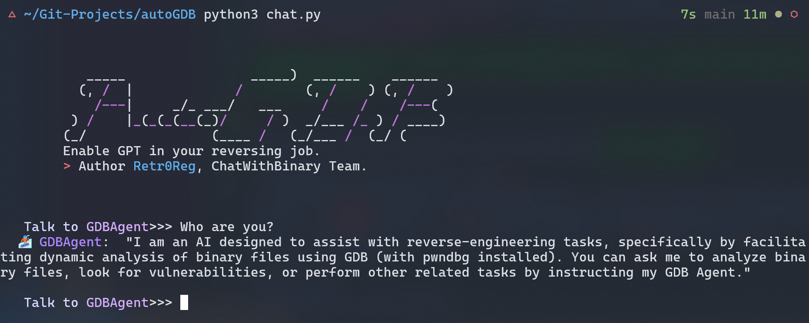

# AutoGDB

<p align="center">
<a href="https://opensource.org/licenses/MIT"></a>
<a href="https://github.com/retr0reg/AutoGDB/issues"></a>
<a href="https://www.python.org/"></a>
<a href="#"></a>
</p>

AutoGDB focused on combining the power of ChatGPT on reverse-engineering, binary-exploitation jobs. 
This project includes:
* `/plugin` **the plugin that your gdb needs to connect to your server**
* `/server` **fastapi backend server**, use to deal with your information and gpts, acts like a bridge between
* `/autogdb` **autogdb pip package**

](https://www.youtube.com/watch?v=FYpdtcC71gg)


# Installing:
If you are new to AutoGDB, clone our project first!
# GDB plugin:
```shell
git clone https://github.com/retr0reg/AutoGDB.git && cd AutoGDB
chmod +x ./install.sh && ./install.sh
``` 
`install.sh` will add `plugin/gpt.py` in to your `~/.gdbinit` as a gdb plugin; Or you can do it by editing `~/.gdbinit` manually;

```shell
echo "/YOUR/PATH/TO/autogdb/plugin/gpt.py" >> ~/.gdbinit
```

In you `gdb` or `pwndbg`, You can run:
```shell
pwndbg> autogdb <YOUR_SERVER_IP> <YOUR_SERVER_PORT>
```
* `YOUR_SERVER_IP` : Your ip for the backend server
* `YOUR_SERVER_PORT` : Port for this server

## Chat with GDB！
Run `chat.py`, and chat with your own AutoGDB!
```
python3 chat.py
```



If you want to develop our project, check out our wonderful and written-with-heart `autogdb_demo.py`, it explains everything! run it by `python3 autogdb_demo.py`

**In gdb, make sure first to run the program and Ctrl-C to stop, then enter the autogdb command**


here's one wonderful example of analysis made by **GPT4, OpenAI**
```python
> Entering new AgentExecutor chain...
To determine if the binary has a vulnerability, I need to start by analyzing the binary with GDB to check for any obvious signs of insecure patterns or practices such as unsafe functions, lack of bounds checking, or any other potential security weaknesses.

Action: gdb
Action Input: info functions
Observation: "All defined functions:\n\nNon-debugging symbols:\n0x0000000000000610  _init\n0x0000000000000640  printf@plt\n0x0000000000000650  read@plt\n0x0000000000000660  strcmp@plt\n0x0000000000000670  setvbuf@plt\n0x0000000000000680  __cxa_finalize@plt\n0x0000000000000690  _start\n0x00000000000006c0  deregister_tm_clones\n0x0000000000000700  register_tm_clones\n0x0000000000000750  __do_global_dtors_aux\n0x0000000000000790  frame_dummy\n0x000000000000079a  main\n0x0000000000000830  __libc_csu_init\n0x00000000000008a0  __libc_csu_fini\n0x00000000000008a4  _fini\n"
Thought:The list of functions provided does not immediately suggest a vulnerability, as these are standard functions that one might expect to find in a binary. However, the presence of functions like `printf` and `read` could potentially be of interest, as they can be involved in vulnerabilities if not used correctly (e.g., format string vulnerabilities or buffer overflows). To proceed, I should examine the `main` function to understand how these functions are used within the program.

Action: gdb
Action Input: disassemble main
Observation: "Dump of assembler code for function main:\n   0x000000000000079a <+0>:\tpush   rbp\n   0x000000000000079b <+1>:\tmov    rbp,rsp\n   0x000000000000079e <+4>:\tmov    rax,QWORD PTR [rip+0x20087b]        # 0x201020 <stdout@@GLIBC_2.2.5>\n   0x00000000000007a5 <+11>:\tmov    ecx,0x0\n   0x00000000000007aa <+16>:\tmov    edx,0x2\n   0x00000000000007af <+21>:\tmov    esi,0x0\n   0x00000000000007b4 <+26>:\tmov    rdi,rax\n   0x00000000000007b7 <+29>:\tcall   0x670 <setvbuf@plt>\n   0x00000000000007bc <+34>:\tmov    rax,QWORD PTR [rip+0x20086d]        # 0x201030 <stdin@@GLIBC_2.2.5>\n   0x00000000000007c3 <+41>:\tmov    ecx,0x0\n   0x00000000000007c8 <+46>:\tmov    edx,0x2\n   0x00000000000007cd <+51>:\tmov    esi,0x0\n   0x00000000000007d2 <+56>:\tmov    rdi,rax\n   0x00000000000007d5 <+59>:\tcall   0x670 <setvbuf@plt>\n   0x00000000000007da <+64>:\tmov    edx,0x64\n   0x00000000000007df <+69>:\tlea    rsi,[rip+0x20085a]        # 0x201040 <buf>\n   0x00000000000007e6 <+76>:\tmov    edi,0x0\n   0x00000000000007eb <+81>:\tmov    eax,0x0\n   0x00000000000007f0 <+86>:\tcall   0x650 <read@plt>\n   0x00000000000007f5 <+91>:\tlea    rsi,[rip+0xb8]        # 0x8b4\n   0x00000000000007fc <+98>:\tlea    rdi,[rip+0x20083d]        # 0x201040 <buf>\n   0x0000000000000803 <+105>:\tcall   0x660 <strcmp@plt>\n   0x0000000000000808 <+110>:\ttest   eax,eax\n   0x000000000000080a <+112>:\tjne    0x813 <main+121>\n   0x000000000000080c <+114>:\tmov    eax,0x0\n   0x0000000000000811 <+119>:\tjmp    0x826 <main+140>\n   0x0000000000000813 <+121>:\tlea    rdi,[rip+0x200826]        # 0x201040 <buf>\n   0x000000000000081a <+128>:\tmov    eax,0x0\n   0x000000000000081f <+133>:\tcall   0x640 <printf@plt>\n   0x0000000000000824 <+138>:\tjmp    0x7da <main+64>\n   0x0000000000000826 <+140>:\tpop    rbp\n   0x0000000000000827 <+141>:\tret    \nEnd of assembler dump.\n"
Thought:The disassembled main function shows several key operations. The program is setting up buffer handling with `setvbuf` for both `stdin` and `stdout`, which is a normal operation to control buffering. It then reads up to 0x64 (100) bytes from file descriptor 0 (which is `stdin` in Unix-like systems) into a buffer located at `0x201040`. After reading the input, it compares this buffer with a string located at an offset from the current instruction pointer (the address is not shown in the disassembly but is referenced as `0x8b4`). If the `strcmp` result is zero (meaning the strings are equal), it takes one branch; otherwise, it prints the buffer using `printf` and then loops back to read more input.

The use of `read` with a fixed size is not immediately indicative of a buffer overflow, as we don't know the actual size of the buffer at `0x201040`. However, the use of `printf` with the buffer as a format string is potentially dangerous because if the buffer contains format specifiers (e.g., `%s`, `%x`), they could be used to leak memory contents or cause a crash, which indicates a format string vulnerability.

To confirm the size of the buffer and see if there is a potential for buffer overflow, I need to examine the memory layout of the program, specifically the `.bss` section where uninitialized data like buffers are typically stored.

Action: gdb
Action Input: info variables
Observation: "All defined variables:\n\nNon-debugging symbols:\n0x00000000000008b0  _IO_stdin_used\n0x00000000000008c0  __GNU_EH_FRAME_HDR\n0x0000000000000a04  __FRAME_END__\n0x0000000000200da0  __frame_dummy_init_array_entry\n0x0000000000200da0  __init_array_start\n0x0000000000200da8  __do_global_dtors_aux_fini_array_entry\n0x0000000000200da8  __init_array_end\n0x0000000000200db0  _DYNAMIC\n0x0000000000200fa0  _GLOBAL_OFFSET_TABLE_\n0x0000000000201000  __data_start\n0x0000000000201000  data_start\n0x0000000000201008  __dso_handle\n0x0000000000201010  __TMC_END__\n0x0000000000201010  __bss_start\n0x0000000000201010  _edata\n0x0000000000201020  stdout\n0x0000000000201020  stdout@@GLIBC_2.2.5\n0x0000000000201030  stdin\n0x0000000000201030  stdin@@GLIBC_2.2.5\n0x0000000000201038  completed\n0x0000000000201040  buf\n0x00000000002010a8  _end\n"
Thought:The `info variables` command in GDB lists global and static variables, including those in the `.bss` section. The buffer `buf` is located at `0x201040`, and the next variable `completed` is at `0x201038`. This suggests that the buffer `buf` is located just before `completed`. The difference in addresses between `buf` and `_end` (which marks the end of the `.bss` section) is `0x10a8 - 0x1040 = 0x68` bytes (104 bytes in decimal).

This is a critical observation: the `read` function is called with a length of `0x64` (100 bytes), and the buffer `buf` is 104 bytes long. Therefore, there is no direct buffer overflow vulnerability since the `read` call does not exceed the size of the buffer. However, there is very little space for a null terminator, and if the input does not contain a null byte, this could lead to issues with string handling, although this is not confirmed from the current information.

The potential format string vulnerability identified earlier is still a concern because the `printf` function is called with the buffer as the format string. If an attacker can control the contents of the buffer and include format specifiers, they could exploit this vulnerability.

To confirm the format string vulnerability, I should check the arguments passed to `printf`. If the buffer is directly used as the format string without any additional arguments, this would confirm the vulnerability.

Action: gdb
Action Input: disassemble main
Observation: "Dump of assembler code for function main:\n   0x000000000000079a <+0>:\tpush   rbp\n   0x000000000000079b <+1>:\tmov    rbp,rsp\n   0x000000000000079e <+4>:\tmov    rax,QWORD PTR [rip+0x20087b]        # 0x201020 <stdout@@GLIBC_2.2.5>\n   0x00000000000007a5 <+11>:\tmov    ecx,0x0\n   0x00000000000007aa <+16>:\tmov    edx,0x2\n   0x00000000000007af <+21>:\tmov    esi,0x0\n   0x00000000000007b4 <+26>:\tmov    rdi,rax\n   0x00000000000007b7 <+29>:\tcall   0x670 <setvbuf@plt>\n   0x00000000000007bc <+34>:\tmov    rax,QWORD PTR [rip+0x20086d]        # 0x201030 <stdin@@GLIBC_2.2.5>\n   0x00000000000007c3 <+41>:\tmov    ecx,0x0\n   0x00000000000007c8 <+46>:\tmov    edx,0x2\n   0x00000000000007cd <+51>:\tmov    esi,0x0\n   0x00000000000007d2 <+56>:\tmov    rdi,rax\n   0x00000000000007d5 <+59>:\tcall   0x670 <setvbuf@plt>\n   0x00000000000007da <+64>:\tmov    edx,0x64\n   0x00000000000007df <+69>:\tlea    rsi,[rip+0x20085a]        # 0x201040 <buf>\n   0x00000000000007e6 <+76>:\tmov    edi,0x0\n   0x00000000000007eb <+81>:\tmov    eax,0x0\n   0x00000000000007f0 <+86>:\tcall   0x650 <read@plt>\n   0x00000000000007f5 <+91>:\tlea    rsi,[rip+0xb8]        # 0x8b4\n   0x00000000000007fc <+98>:\tlea    rdi,[rip+0x20083d]        # 0x201040 <buf>\n   0x0000000000000803 <+105>:\tcall   0x660 <strcmp@plt>\n   0x0000000000000808 <+110>:\ttest   eax,eax\n   0x000000000000080a <+112>:\tjne    0x813 <main+121>\n   0x000000000000080c <+114>:\tmov    eax,0x0\n   0x0000000000000811 <+119>:\tjmp    0x826 <main+140>\n   0x0000000000000813 <+121>:\tlea    rdi,[rip+0x200826]        # 0x201040 <buf>\n   0x000000000000081a <+128>:\tmov    eax,0x0\n   0x000000000000081f <+133>:\tcall   0x640 <printf@plt>\n   0x0000000000000824 <+138>:\tjmp    0x7da <main+64>\n   0x0000000000000826 <+140>:\tpop    rbp\n   0x0000000000000827 <+141>:\tret    \nEnd of assembler dump.\n"
Thought:The re-examination of the `main` function's disassembly confirms that the `printf` call at address `0x081f` uses the buffer at `0x201040` directly as the format string (`rdi` register holds the first argument to functions in the x86_64 calling convention, which is the format string for `printf`). There are no additional arguments being pushed onto the stack or loaded into registers for this `printf` call, which means that any format specifiers in the buffer will be interpreted by `printf` and could potentially be exploited.

Given this information, it is clear that the binary has a format string vulnerability because it uses uncontrolled input as the format string for `printf`. This could allow an attacker to read from or write to memory locations, depending on the contents of the format string they provide.

Thought: I now know the final answer.
Final Answer: The binary has a format string vulnerability due to the use of an uncontrolled buffer as the format string argument for `printf`.

> Finished chain.
```
# Setup Server-side
**After the `AutoGDB1.2` Version, Serverside-settings will be done within the `chat.py`**, if you have problems with AutoGDB server, you may run `python3 chat.py --serverless` in serverless mode, with ip and ports in `.server_cache_autogdb.json`

The Server-side of AutoGDB can be pull and used by using docker;
```shell
docker pull retr0regd/autogdb-server:latest
docker run -p 5000:5000 retr0regd/autogdb-server:latest
```
After this, the server will be running on `5000` port in `127.0.0.1`

Or you may simply use `python3` to install:

```shell
python3 -m pip install -r requirements.txt && chmod +x ./run.sh
```
after installing requirements, you can run the server by `./run.sh`
